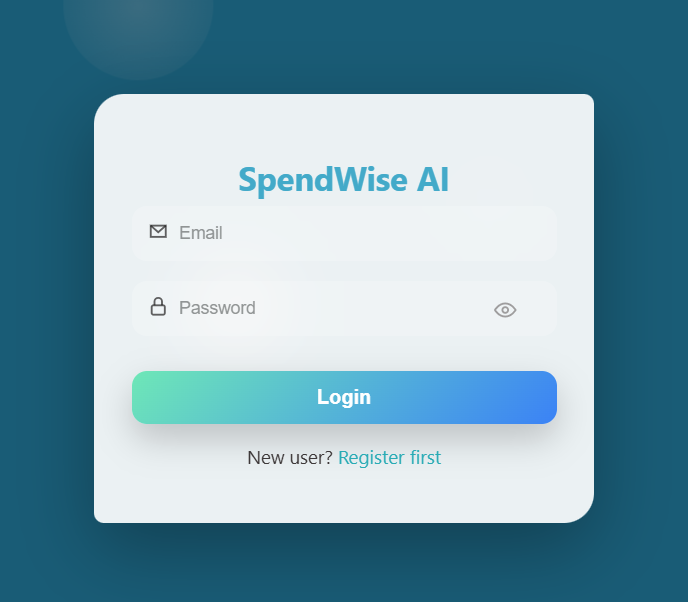
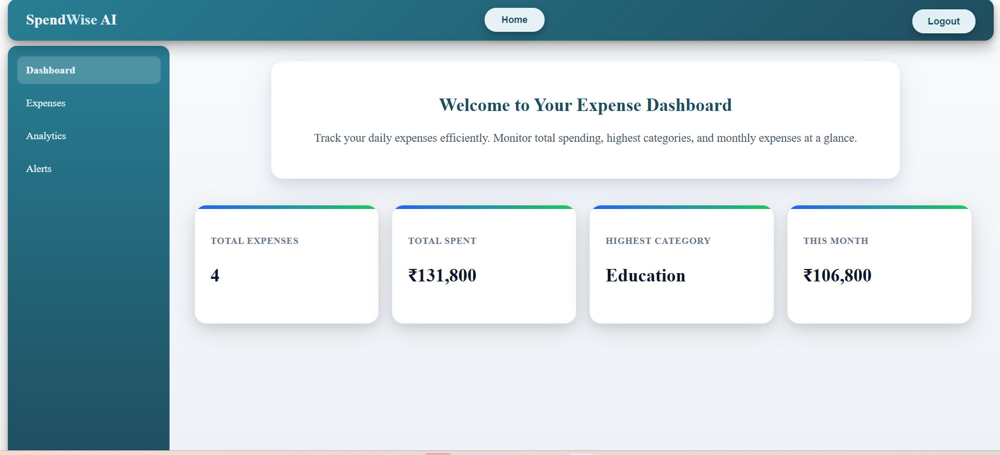
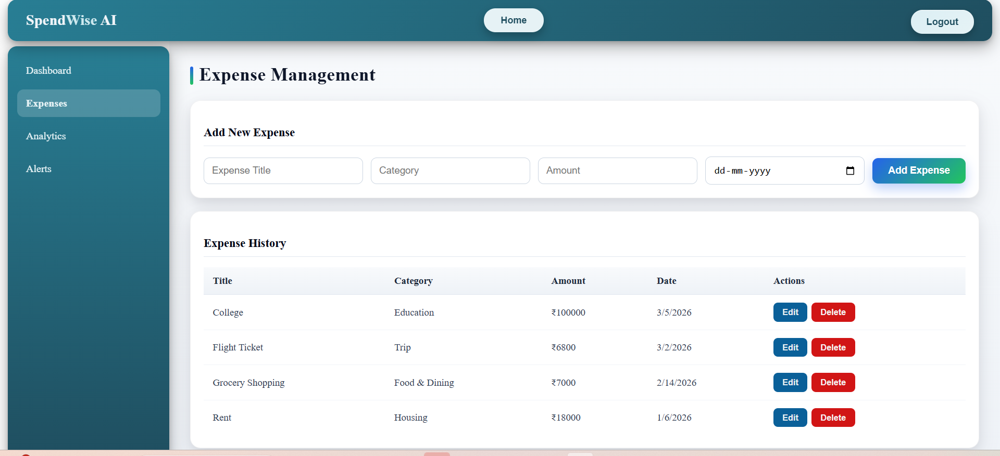
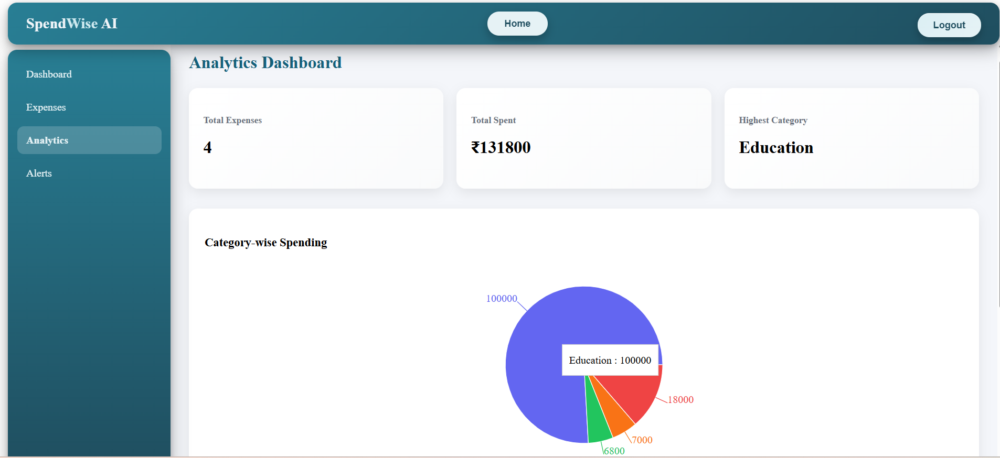
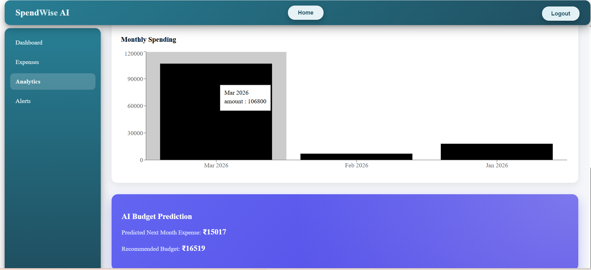
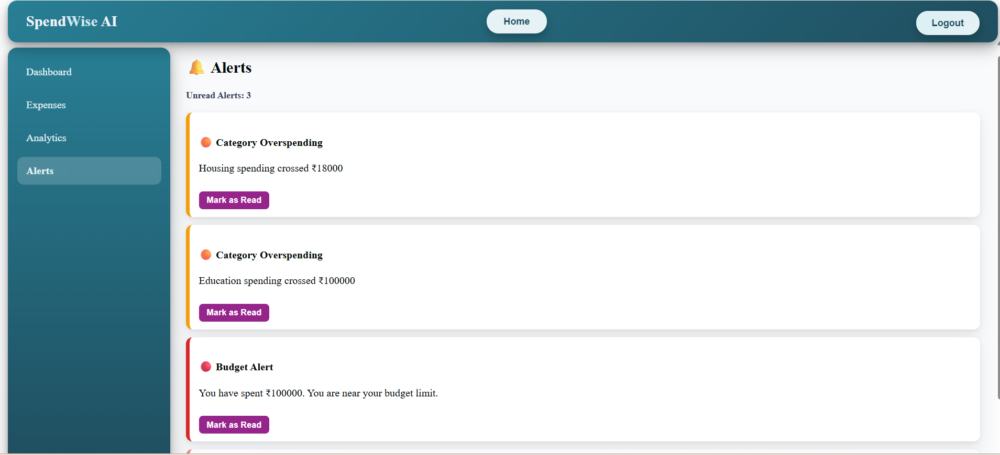

# 🚀 SpendWise_AI
## 💰 Personal Finance & Expense Analytics Platform

**SpendWise_AI** is a secure full-stack MERN application that enables users to track, analyze, and optimize their financial activities using intelligent insights and real-time analytics.


---

## 🔥 Project Overview
- Engineered a secure full-stack personal finance platform with JWT-based authentication, protected REST APIs, and strict user-specific data isolation for managing income and expenses.
- Built an interactive analytics dashboard featuring real-time charts, category-wise breakdowns, and monthly financial summaries to visualize spending behavior.
- Integrated AI-driven expense forecasting using TensorFlow.js linear regression (SGD + MSE) to predict next-month trends and generate smart alerts for unusual spending patterns.

---

## 🧠 Key Features
- 🔐 **Secure Authentication & Authorization**  
  JWT-based login and registration with protected routes and strict user-level financial data isolation.
- 💰 **Expense Management (Full CRUD)**  
  Add, update, delete, and categorize income and expenses with persistent MongoDB storage.
- 📊 **Real-Time Analytics Dashboard**  
  Dynamic charts with category-wise breakdowns and monthly financial summaries for clear spending visualization.
- 🤖 **AI-Based Expense Forecasting**  
  TensorFlow.js linear regression model (SGD + MSE) to analyze historical data and predict next-month salary and expense trends.
- 🚨 **Smart Alert System**  
  Detects unusual spending behavior and triggers proactive budget alerts.
- ⚡ **Scalable Full-Stack Architecture**  
  Seamless integration of React frontend with Node.js, Express, and MongoDB backend.

---

## 🛠 Tech Stack

| Category            | Technologies Used                         |
|---------------------|-------------------------------------------|
| Frontend            | React.js, JavaScript (ES6+), HTML5, CSS3 |
| Backend             | Node.js, Express.js                       |
| Database            | MongoDB, Mongoose ODM                     |
| Machine Learning    | TensorFlow.js                             |
| Authentication      | JSON Web Tokens (JWT)                     |
| API Architecture    | RESTful APIs                              |
| Version Control     | Git, GitHub                               |

---

## 📁 Folder Structure

```bash
SpendWise_AI/
│
├── backend/                         # Express server & API logic
│   ├── config/                      # Database configuration
│   ├── controllers/                 # Business logic for routes
│   ├── middleware/                  # JWT authentication middleware
│   ├── models/                      # Mongoose schemas
│   ├── routes/                      # API route definitions
│   ├── ml/                          # TensorFlow.js ML models for prediction
│   ├── utils/                       # Helper functions and utilities
│   ├── server.js                    # Backend entry point
│   ├── package.json
│   └── .env                         # Sample environment variables
│
├── frontend/                        # React application
│   ├── public/                      # Static assets
│   ├── src/
│   │   ├── components/              # Reusable UI components
│   │   ├── pages/                   # Page-level components
│   │   ├── App.js
│   │   └── index.js
│   └── package.json
│
└── README.md

⚡ Efficient State Management
    Uses React useState and useEffect for state handling; Context API not needed due to simple data flow.
```
## ⚙️ Setup Instructions

### 1️⃣ Clone the Repository
```bash
git clone https://github.com/Padma-darsi/SpendWise_AI.git
cd SpendWise_AI
```
### 2️⃣ Backend Setup
```bash
cd backend
npm install
```

Create a .env file in the backend directory with the following content:
```bash
PORT=5000
MONGO_URI=your_mongodb_connection_string
JWT_SECRET=your_secret_key
```
Start the backend server:
```bash
npm run dev
```

The backend server will run on:
 http://localhost:5000
 
### 3️⃣ Frontend Setup
```bash
cd frontend
npm install
npm start
```

The frontend application will run on:
 http://localhost:3000
 
### 🔄 Application Flow
```bash
Client (React Frontend)
        ↓
API Request
        ↓
JWT Authentication Middleware
        ↓
Controller Logic
        ↓
MongoDB Database
        ↓
Response to Client
```
## 📸 Screenshots

### 🔐 Authentication (Login & Register)

| Login | Register |
|-------|---------|
|  |  |

---

### 💰 Dashboard


---

### ➕ Add Expense


---

### 📊 Analytics

**📈 Analytics Summary & Category-Wise Charts**  



**📅 Monthly Spending & AI Predictions** 



---

### 🔔 Alerts Page



## 🌐 Live Demo

🚀 **Live Application:**  
https://spend-wise-ai-frontend.vercel.app/

🖥️ **Frontend:** Deployed on Vercel  
⚙️ **Backend:** Deployed on Render  
🗄️ **Database:** MongoDB Atlas

## 📝 Contributing & Issues
- Found a bug or want to request a feature? [Open an issue](https://github.com/Padma-darsi/SpendWise_AI/issues)
- Want to contribute? Check the [contributing guidelines](https://github.com/Padma-darsi/SpendWise_AI/blob/master/CONTRIBUTING.md)
